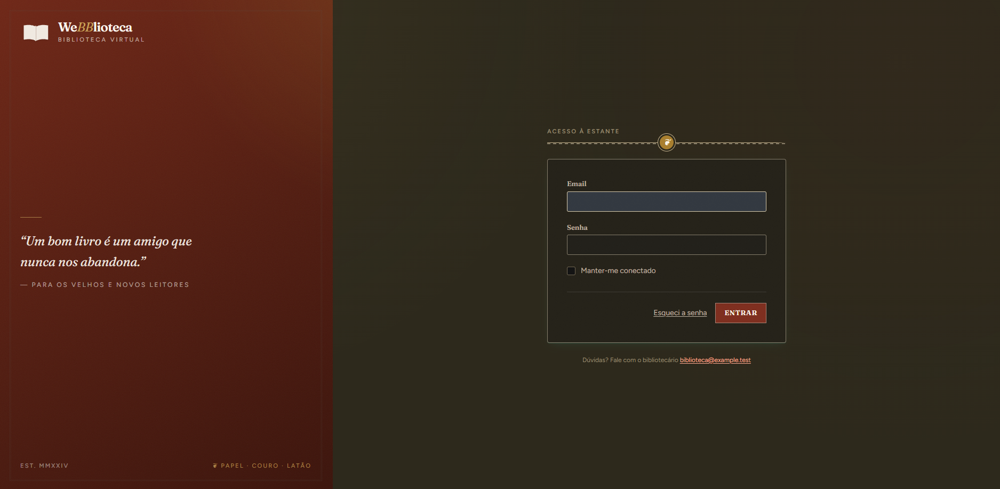
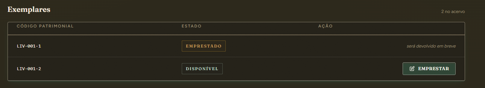
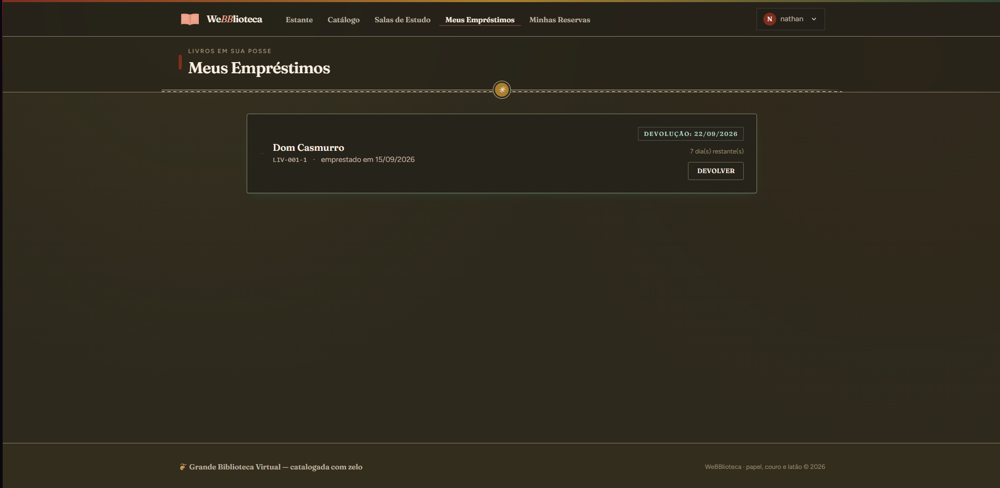
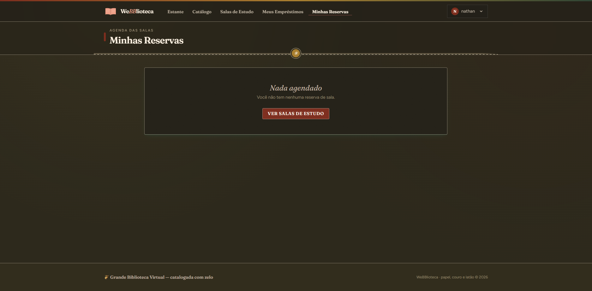
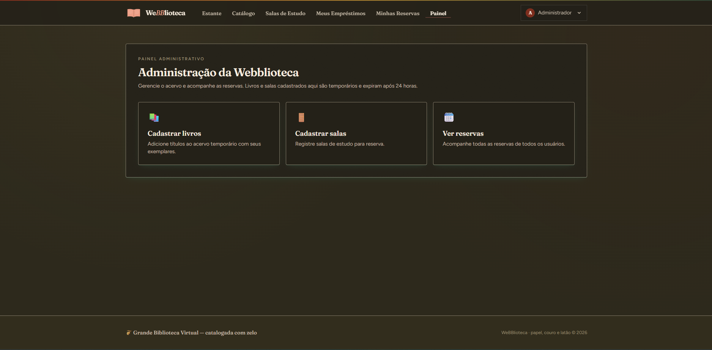
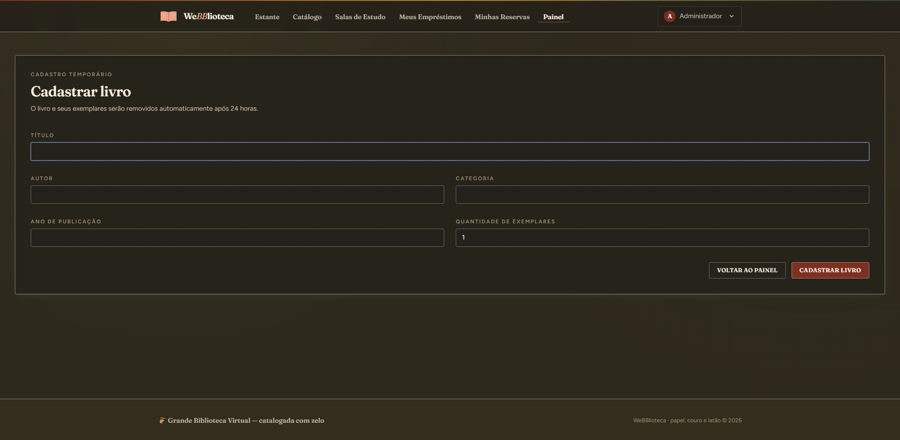
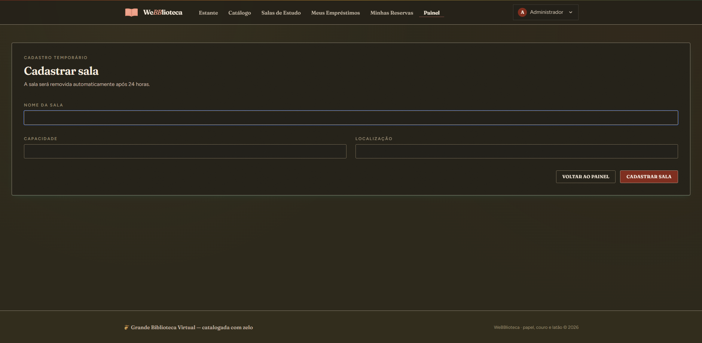
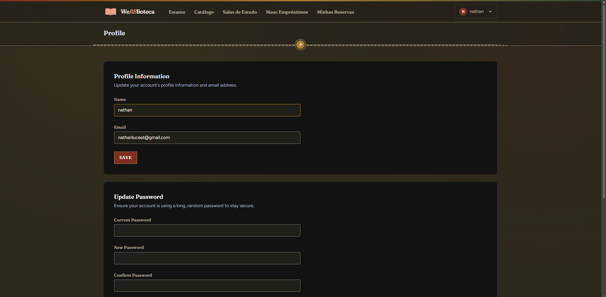
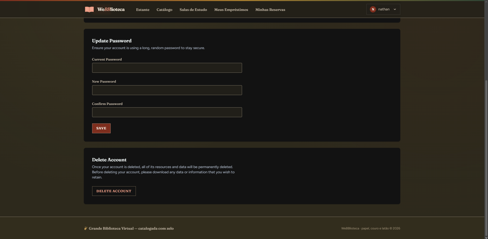
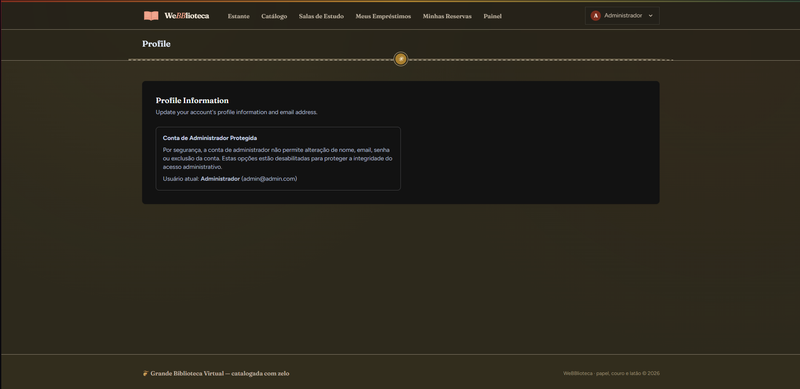

# 🖼️ Webblioteca — Galeria de Prints

> Galeria completa de capturas de tela do sistema, em ordem de fluxo. Todas as imagens ficam no diretório `.github/images/`.

---

## 01 · Tela de Cadastro

**Descrição:** Tela de cadastro ("Criar Cadastro"), com campos de nome, e-mail, senha e confirmação de senha.

---

## 02 · Tela de Login

**Descrição:** Tela de login ("Acesso à Estante"), com e-mail, senha e opção "Manter-me conectado".

---

## 03 · Dashboard do Usuário

**Descrição:** Dashboard do usuário comum (nathan) logado — ficha do leitor, balancete (empréstimos/reservas ativas) e atalhos rápidos.

---

## 04 · Catálogo de Livros

**Descrição:** Catálogo de livros em grade, mostrando os 12 títulos cadastrados com categoria, autor e ano.

---

## 05 · Detalhe do Livro

**Descrição:** Página de detalhe de "Dom Casmurro", com ficha bibliográfica e a lista de 2 exemplares disponíveis para empréstimo.

---

## 06 · Exemplar Emprestado

**Descrição:** Zoom na tabela de exemplares do mesmo livro, agora mostrando um exemplar com status "Emprestado" (com aviso "será devolvido em breve") e o outro ainda disponível.

---

## 07 · Meus Empréstimos

**Descrição:** Tela "Meus Empréstimos", mostrando o livro emprestado, prazo de devolução, dias restantes e botão de devolver.

---

## 08 · Salas de Estudo

**Descrição:** Listagem das 6 salas de estudo cadastradas, com capacidade e localização de cada uma.

---

## 09 · Minhas Reservas (vazio)

**Descrição:** Tela "Minhas Reservas" no estado vazio (usuário sem nenhuma reserva ativa ainda).

---

## 10 · Dashboard do Administrador

**Descrição:** Mesmo dashboard, mas logado como Administrador — repare no item extra "Painel" destacado no menu, que só aparece pra essa conta.

---

## 11 · Painel Administrativo

**Descrição:** Painel administrativo, com os 3 atalhos principais: cadastrar livros, cadastrar salas e ver reservas de todos os usuários.

---

## 12 · Cadastrar Livro

**Descrição:** Formulário de cadastro de livro (título, autor, categoria, ano, quantidade de exemplares), com aviso de que é temporário (expira em 24h).

---

## 13 · Cadastrar Sala

**Descrição:** Formulário de cadastro de sala (nome, capacidade, localização), com o mesmo aviso de expiração em 24h.

---

## 14 · Perfil do Usuário

**Descrição:** Página de perfil (parte de cima) do usuário comum, com edição de nome/e-mail.

---

## 15 · Troca de Senha e Exclusão de Conta

**Descrição:** Mesma página de perfil, rolada pra baixo — seção de troca de senha e exclusão de conta.

---

## 16 · Reservas de Todos os Usuários (Admin)

**Descrição:** Tela de "Reservas de salas" do painel admin, listando as reservas de todos os usuários (inclusive a do usuário "nathan", destacada) — essa é a funcionalidade que você pediu especificamente para o admin acompanhar.

---

## 17 · Perfil do Administrador (Protegido)

**Descrição:** Página de perfil acessada pela conta de Administrador — mostrando que os campos de edição/senha/exclusão foram bloqueados propositalmente ("Conta de Administrador Protegida"), preservando o acesso administrativo do projeto de demonstração.

---

## 18 · Landing Page

**Descrição:** Página inicial (landing page) para visitantes não logados, com chamada para ação de cadastro/login.

---

**[← Voltar ao README](./README.md)**