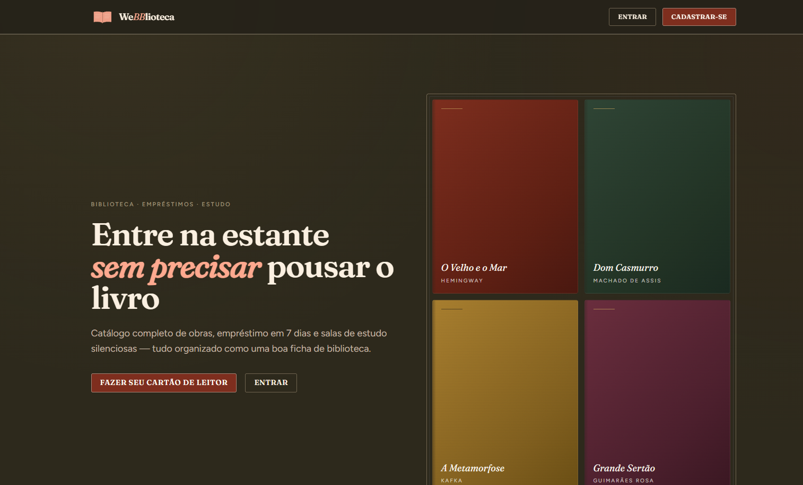
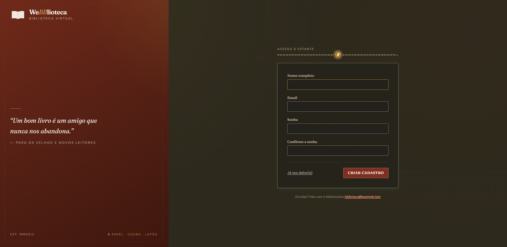
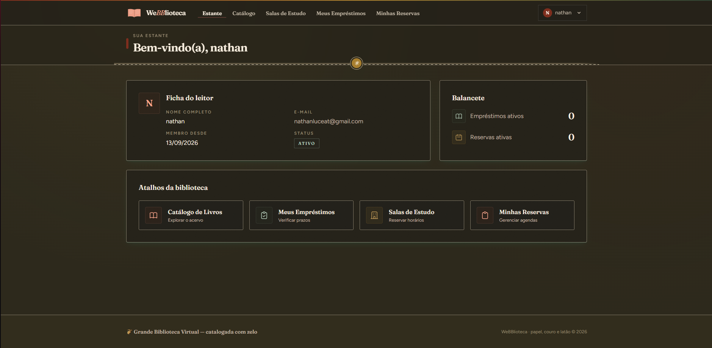
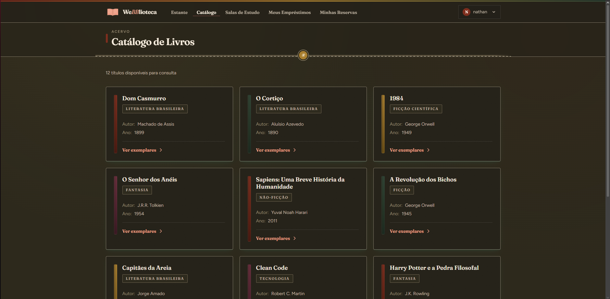
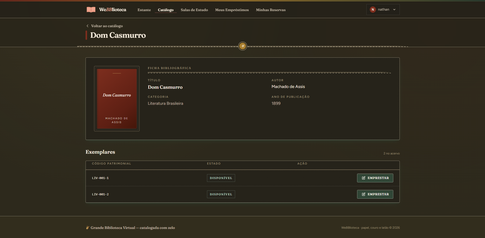
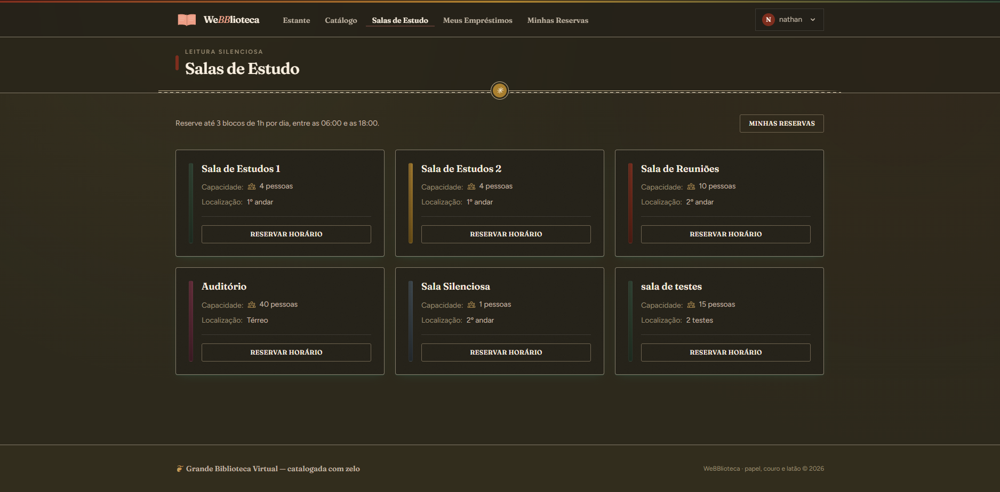
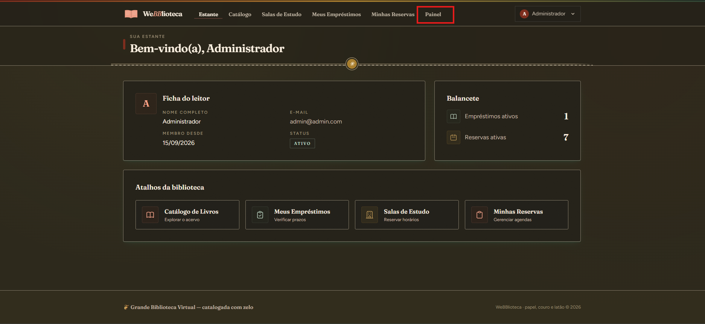
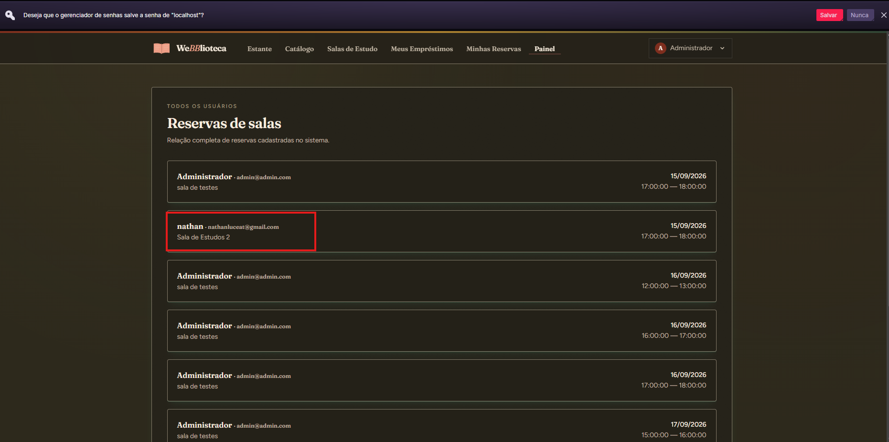

# 📚 Webblioteca

> Sistema de gerenciamento de biblioteca com empréstimo de livros e reserva de salas de estudo

**Webblioteca** é um projeto de portfólio desenvolvido em Laravel que demonstra modelagem relacional de banco de dados, autenticação de usuários, e lógica de negócio para gerenciamento de biblioteca. O sistema oferece duas funcionalidades principais: controle de empréstimos de exemplares físicos e agendamento de salas de estudo.

---

## 📋 Índice

- [Funcionalidades](#-funcionalidades)
- [Prints do Projeto](#-prints-do-projeto)
- [Tecnologias](#-tecnologias)
- [Requisitos](#-requisitos)
- [Instalação](#-instalação)
- [Possíveis Erros](#-possíveis-erros)
- [Credenciais de Acesso](#-credenciais-de-acesso)
- [Estrutura do Banco de Dados](#-estrutura-do-banco-de-dados)
- [Regras de Negócio](#-regras-de-negócio)
- [Painel Administrativo](#-painel-administrativo)
- [Testes](#-testes)
- [Timezone](#-timezone)
- [Documentação Técnica](#-documentação-técnica)

---

## ✨ Funcionalidades

### Para Usuários

- **Autenticação completa** — cadastro, login, recuperação de senha via Laravel Breeze
- **Catálogo de livros** — navegação e consulta de disponibilidade de exemplares
- **Empréstimos** — solicitação de empréstimo de livros disponíveis (prazo: 7 dias)
- **Devolução** — registro de devolução de livros emprestados
- **Reserva de salas** — agendamento de salas de estudo por blocos de 1 hora
- **Gerenciamento pessoal** — visualização de empréstimos ativos e reservas futuras

### Para Administradores

- **Painel administrativo** — acesso exclusivo via `/admin`
- **Cadastro temporário** — adição de livros e salas para demonstração (expiram em 24h)
- **Monitoramento** — visualização de todas as reservas de salas do sistema
- **Conta protegida** — impossibilidade de alterar credenciais ou excluir a conta admin

---

## 📸 Prints do Projeto

| | |
|---|---|
| **Landing Page** | **Cadastro** |
|  |  |
| **Dashboard do Usuário** | **Catálogo de Livros** |
|  |  |
| **Detalhe do Livro** | **Salas de Estudo** |
|  |  |
| **Dashboard do Administrador** | **Reservas de Todos os Usuários** |
|  |  |

> 🖼️ **Mais prints:** confira a **[galeria completa de prints](./PRINTS.md)** com as 18 capturas de tela, cada uma acompanhada de uma breve descrição.

---

## 🛠 Tecnologias

| Camada | Tecnologia |
|--------|-----------|
| **Backend** | Laravel 11 (PHP 8.5) |
| **Banco de Dados** | MySQL 8.4 |
| **Frontend** | Blade Templates + Tailwind CSS |
| **Autenticação** | Laravel Breeze (stack Blade + Alpine.js) |
| **Ambiente** | Docker via Laravel Sail |
| **Testes** | PHPUnit 12 (32 testes, 83 assertions) |

---

## 📦 Requisitos

- **Docker Desktop** (Windows/Mac) ou **Docker Engine** (Linux)
- **WSL 2** (apenas Windows)
- **Git**

O Laravel Sail gerencia todas as dependências (PHP, MySQL, Node, Composer) dentro de containers Docker, eliminando a necessidade de instalá-las localmente.

---

## 🚀 Instalação

### ✅ Opção rápida — script `setup.sh`

O repositório inclui o script **`setup.sh`**, que automatiza toda a configuração do ambiente em um único comando:

```bash
git clone https://github.com/NathanLuceat/webblioteca.git
cd webblioteca
./setup.sh
```

O script irá, automaticamente:
- Criar o arquivo `.env` a partir do `.env.example` (se ainda não existir)
- Subir os containers Docker
- Instalar as dependências do Composer
- Gerar a chave da aplicação
- Executar as migrations e seeders, aguardando o banco de dados ficar pronto
- Exibir a mensagem **"Tudo pronto!"** com o endereço de acesso e as credenciais administrativas

### 🛠 Opção manual — passo a passo

Se preferir executar cada etapa separadamente:

#### 1. Clone o repositório

```bash
git clone https://github.com/NathanLuceat/webblioteca.git
cd webblioteca
```

#### 2. Configure o ambiente

```bash
cp .env.example .env
```

#### 3. Inicie os containers

```bash
./vendor/bin/sail up -d
```

O comando acima irá:
- Baixar e construir as imagens Docker necessárias
- Iniciar os serviços (Laravel, MySQL, Redis, Mailpit, etc.)
- Expor a aplicação em `http://localhost`

#### 4. Instale as dependências e prepare o banco

```bash
./vendor/bin/sail composer install
./vendor/bin/sail artisan key:generate
./vendor/bin/sail artisan migrate:fresh --seed
```

O comando `migrate:fresh --seed` irá:
- Criar todas as tabelas do banco de dados
- Popular o banco com:
  - 10 livros (cada um com exemplares variados)
  - 5 salas de estudo
  - 1 conta de administrador

#### 5. Acesse a aplicação

Abra o navegador em **http://localhost**

---

## ⚠️ Possíveis Erros

### Docker não inicia / WSL 2 não é reconhecido

Se o Docker Desktop exibe erros como *"Docker Desktop requires WSL 2 backend"* ou *"WSL 2 installation is incomplete"*, verifique as duas configurações abaixo:

#### 1. Ativar a Virtualização na BIOS/UEFI

A virtualização de hardware (Intel **VT-x** ou AMD **SVM**) precisa estar habilitada na BIOS/UEFI do seu computador:

1. Reinicie o computador e entre na BIOS/UEFI (geralmente pressionando `F2`, `F10` ou `Del` durante a inicialização)
2. Procure por uma opção chamada **Intel Virtualization Technology (VT-x)**, **AMD-V** ou **SVM Mode** — geralmente em `Advanced` → `CPU Configuration`
3. **Ative** a opção e salve as alterações
4. Reinicie o computador

> **⚠️** Se essa opção não estiver ativada, o WSL 2 **não funcionará**, impedindo o Docker de operar.

#### 2. Ativar a Plataforma de Máquina Virtual no Windows

Mesmo com a virtualização habilitada na BIOS, é necessário ativar o recurso de plataforma do WSL 2 no Windows:

1. Abra **Painel de Controle** → **Programas** → **Ativar ou desativar recursos do Windows** (ou pressione `Win + R`, digite `optionalfeatures` e pressione Enter)
2. Marque as seguintes opções:
   - ✅ **Plataforma de Máquina Virtual** (*Virtual Machine Platform*)
   - ✅ **Subsystem do Windows para Linux** (*Windows Subsystem for Linux*)
3. Clique em **OK** e **reinicie** o computador

> **⚠️** Ambas as opções precisam estar marcadas. Após a ativação, reinicie o computador antes de tentar usar o Docker novamente.

### Verificando se tudo está configurado

Após reiniciar, execute no PowerShell ou CMD:

```powershell
wsl --status
```

Se a saída indicar que o WSL 2 está ativo e a versão do kernel está atualizada, tudo está funcionando corretamente.

### Outros erros comuns

| Erro | Solução |
|------|---------|
| `Error response from daemon: Ports are not available` | Porta 80 já em uso — feche o programa que a utiliza ou altere a porta no arquivo `.env` |
| `Could not connect to the Docker daemon` | O Docker Desktop não está em execução — inicie-o antes de rodar o Sail |
| `No space left on device` | Limpe imagens e containers não utilizados com `docker system prune` |

---

## 🔐 Credenciais de Acesso

### Conta de Administrador

| Campo | Valor |
|-------|-------|
| **E-mail** | `admin@admin.com` |
| **Senha** | `admin@webblioteca` |
| **Acesso** | http://localhost/admin |

> **⚠️ Proteção da Conta Admin**
> 
> Por segurança, a conta de administrador possui restrições especiais:
> - ❌ Não pode alterar o próprio nome
> - ❌ Não pode alterar o próprio e-mail
> - ❌ Não pode alterar a própria senha
> - ❌ Não pode excluir a própria conta
> 
> Essas restrições garantem a integridade do acesso administrativo ao sistema.

### Criar Conta de Usuário

Novos usuários podem se cadastrar em **http://localhost/register**

---

## 🗄 Estrutura do Banco de Dados

### Diagrama de Relacionamentos

```
users (1) ────┬──── (N) emprestimos
              │
              └──── (N) reservas_salas
              
livros (1) ──── (N) exemplares (1) ──── (N) emprestimos

salas (1) ──── (N) reservas_salas
```

### Tabelas Principais

| Tabela | Descrição | Campos Principais |
|--------|-----------|-------------------|
| **users** | Usuários do sistema | `id`, `name`, `email`, `password`, `is_admin` |
| **livros** | Catálogo de títulos | `id`, `titulo`, `autor`, `categoria`, `ano_publicacao`, `temporario` |
| **exemplares** | Cópias físicas dos livros | `id`, `livro_id`, `codigo_patrimonio`, `status` |
| **salas** | Salas de estudo disponíveis | `id`, `nome`, `capacidade`, `localizacao`, `temporario` |
| **emprestimos** | Registro de empréstimos | `id`, `usuario_id`, `exemplar_id`, `data_emprestimo`, `data_devolucao` |
| **reservas_salas** | Agendamentos de salas | `id`, `usuario_id`, `sala_id`, `data`, `hora_inicio`, `hora_fim` |

### Status dos Exemplares

- `disponivel` — pode ser emprestado
- `emprestado` — em posse de um usuário

---

## 📜 Regras de Negócio

### Empréstimos

- ✅ Prazo fixo de **7 dias corridos**
- ✅ Apenas exemplares com status `disponivel` podem ser emprestados
- ✅ Apenas o próprio usuário pode devolver seus empréstimos
- ✅ Um exemplar emprestado fica indisponível para outros usuários

### Reservas de Salas

- ✅ **Dias permitidos:** hoje, amanhã e depois de amanhã
- ✅ **Horários disponíveis:** 12 blocos de 1 hora entre 06:00 e 18:00
- ✅ **Limite por usuário:** máximo 3 blocos por dia, por sala
- ✅ **Conflitos:** 
  - Uma sala não pode ter duas reservas no mesmo horário
  - Um usuário não pode ter duas reservas (em salas diferentes) no mesmo horário
- ✅ **Limpeza automática:** reservas expiradas são removidas ao carregar qualquer página

---

## 🎛 Painel Administrativo

### Acesso

1. Faça login com a conta administrativa
2. Acesse **http://localhost/admin**
3. Ou clique no link **"Painel"** no menu superior (visível apenas para admins)

### Funcionalidades

| Recurso | Descrição |
|---------|-----------|
| **Dashboard** | Visão geral com cards de navegação |
| **Cadastrar Livros** | Adiciona título, autor, categoria, ano e quantidade de exemplares |
| **Cadastrar Salas** | Adiciona nome, capacidade e localização |
| **Ver Reservas** | Lista todas as reservas de todos os usuários |

### Registros Temporários

Livros e salas cadastrados pelo painel administrativo são marcados como **temporários** e possuem as seguintes características:

- ⏰ **Expiração:** removidos automaticamente após 24 horas da criação
- 🔄 **Limpeza:** executada via middleware `LimpezaAutomatica` a cada requisição web
- 🎯 **Propósito:** demonstração e testes sem poluir o banco de dados permanente

> **💡 Nota:** Livros e salas criados pelos seeders são marcados como permanentes (`temporario = false`) e nunca são removidos automaticamente.

### Segurança

- 🔒 Todas as rotas `/admin/*` exigem autenticação **e** privilégio de administrador
- 🚫 Usuários comuns recebem erro **403 Forbidden** ao tentar acessar o painel
- ✅ Middleware `EhAdmin` verifica a flag `is_admin` em cada requisição

---

## 🧪 Testes

O projeto possui uma suíte completa de testes automatizados.

### Executar Todos os Testes

```bash
./vendor/bin/sail artisan test
```

**Resultado esperado:**
```
Tests:    32 passed (83 assertions)
Duration: ~5s
```

### Testes do Painel Administrativo

```bash
./vendor/bin/sail artisan test --filter=AdminPanelFeatureTest
```

**Cobertura:**
- ✅ Usuário comum recebe 403 ao acessar `/admin`
- ✅ Admin acessa todas as páginas do painel
- ✅ Admin cadastra livro com exemplares temporários
- ✅ Admin cadastra sala temporária
- ✅ Limpeza remove livros/salas temporários após 24h
- ✅ Limpeza remove reservas expiradas de todos os usuários

---

## 🌍 Timezone

O sistema opera no fuso horário **America/Sao_Paulo** (UTC-3 / Horário de Brasília).

### Configuração

A configuração está em `config/app.php`:

```php
'timezone' => 'America/Sao_Paulo',
```

### Por Que Isso Importa?

O cálculo de expiração de reservas depende do timezone correto:

- ❌ Com `UTC`, reservas do dia podem ser consideradas expiradas prematuramente
- ✅ Com `America/Sao_Paulo`, a validação de horários funciona corretamente

Se você alterar o timezone, limpe o cache:

```bash
./vendor/bin/sail artisan config:clear
```

---

## 📖 Documentação Técnica

Para informações detalhadas sobre a arquitetura, controllers, rotas e estrutura do projeto, consulte:

- **[Documentação Técnica](./DOCUMENTACAO-TECNICA.md)** — documentação completa do projeto para desenvolvimento

### Conteúdo do documento

- Stack técnica e configuração do ambiente
- Schema completo do banco de dados com relacionamentos
- Descrição de todos os Models Eloquent
- Listagem de rotas e seus controllers
- Regras de validação e lógica de negócio
- Guia de views e do que pode ser alterado com segurança
- Metodologia para adicionar funcionalidades
- Histórico de implementações

---

## 🎨 Design System

O projeto utiliza um design system customizado com:

- **Paleta de cores:** leather, ink, folio, brass, paper
- **Tipografia:** fonte display + fonte corpo com hierarquia clara
- **Componentes:** card, paper-grain, label-overline, btn-primary, btn-outline
- **Shadows:** stamp, emboss, folio
- **Layout:** Tailwind CSS com tokens customizados

Todos os componentes seguem o padrão visual definido em `resources/css/app.css`.

---

## 🤝 Comandos Úteis

### Gerenciamento de Containers

```bash
# Iniciar containers em segundo plano
./vendor/bin/sail up -d

# Parar containers
./vendor/bin/sail down

# Ver logs
./vendor/bin/sail logs -f
```

### Artisan

```bash
# Executar migrations
./vendor/bin/sail artisan migrate

# Recriar banco do zero com seeders
./vendor/bin/sail artisan migrate:fresh --seed

# Ver rotas
./vendor/bin/sail artisan route:list

# Executar seeder específico
./vendor/bin/sail artisan db:seed --class=AdminSeeder

# Limpar caches
./vendor/bin/sail artisan optimize:clear
```

### Composer

```bash
# Instalar dependências
./vendor/bin/sail composer install

# Atualizar dependências
./vendor/bin/sail composer update
```

### Tinker (REPL)

```bash
# Abrir console interativo do Laravel
./vendor/bin/sail artisan tinker
```

---

## 📝 Licença

Este é um projeto de portfólio para fins educacionais.

O framework Laravel é open-source sob a licença [MIT](https://opensource.org/licenses/MIT).

---

## 💬 Suporte

Para dúvidas técnicas sobre o Laravel:
- [Documentação Oficial](https://laravel.com/docs)
- [Laracasts](https://laracasts.com)
- [Laravel Learn](https://laravel.com/learn)

---

**Desenvolvido com Laravel 11 + Breeze + Sail** 🚀
